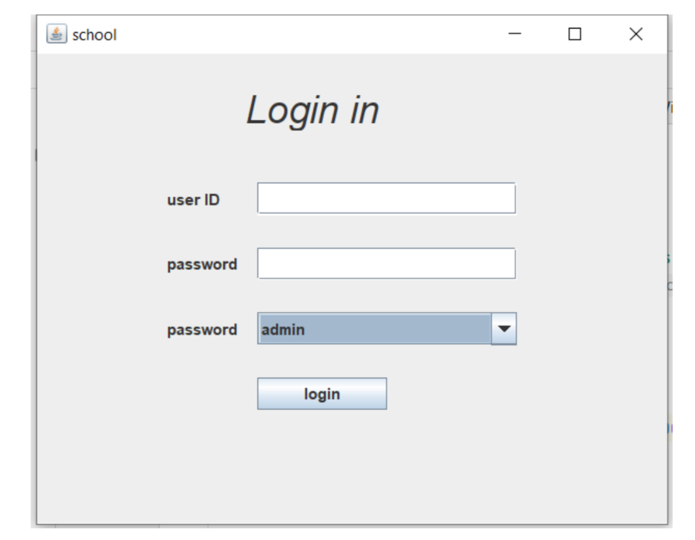
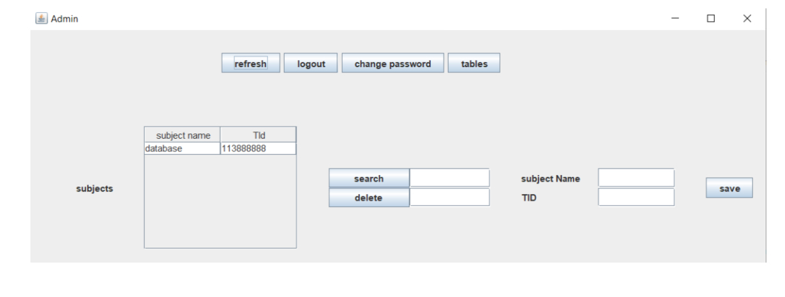

# 📚 School Management System

A **Java-based** School Management System with a **Graphical User Interface (GUI)** using **Swing** and **MySQL** for database management.

## 🚀 Features
- 📌 **Admin Panel:** Manage students, teachers, and subjects.
- 📌 **Teacher Dashboard:** Assign grades and manage students.
- 📌 **Student Dashboard:** View grades and enroll in subjects.
- 📌 **Secure Login System** with different user roles.

## 🖥️ Screenshots
### **🔹 Login Screen**


### **🔹 Database Schema (ERD)**


### **🔹 Admin Panel**


## 🗄️ Database Schema
This project uses **MySQL** for database storage.

## 🎯 How to Run
1. Clone the repository:
   ```bash
   git clone https://github.com/talamh0/School-Management-System.git

2. Configure MySQL Database.  
3. Open the project in IntelliJ IDEA or Eclipse.  
4. Run `Main.java`.  

## 🛠️ Tech Stack
- **Java** (Swing for GUI)
- **MySQL** (Database)
- **JDBC** (Database Connectivity)
- **GitHub** (Version Control)
- 


## 🏗️ Built With
- [Java](https://www.java.com/) - Programming Language
- [MySQL](https://www.mysql.com/) - Relational Database
- [JDBC](https://docs.oracle.com/javase/tutorial/jdbc/) - Java Database Connectivity

👩‍💻 Contributing
Feel free to contribute by submitting pull requests! 💡

